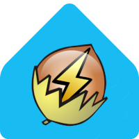

    
     
    <h1>Home Assistant Community Add-on: SmartNUT</h1>

[![GitHub Release][releases-shield]][releases]
![Project Stage][project-stage-shield]
[![License][license-shield]](LICENSE.md)

![Supports armhf Architecture][armhf-shield]
![Supports armv7 Architecture][armv7-shield]
![Supports aarch64 Architecture][aarch64-shield]
![Supports amd64 Architecture][amd64-shield]
![Supports i386 Architecture][i386-shield]

[![Github Actions][github-actions-shield]][github-actions]
![Project Maintenance][maintenance-shield]
[![GitHub Activity][commits-shield]][commits]

[![Discord][discord-shield]][discord]
[![Community Forum][forum-shield]][forum]

[![Buy me a coffee][buymeacoffee-shield]][buymeacoffee]

SmartNUT is a refreshed form-factor of NUT - Network UPS Tools - suited to modern integrations and smart systems, like Home Assistant.

SmartNUT allows you to monitor and manage UPS (battery backup) using a NUT server.
It lets you view their status, receives notifications about important events, and execute commands as device actions.

Conversely to previous NUT Add-on, SmartNUT:

* just uses NUT drivers, and eliminates NUT upsd and client layers, and their configuration complexity
* does not require an additional integration: native support in HA MQTT (hem, todo)
* publishes the data to MQTT (HA local broker autodetected).
But can easily be adapted to any other broker/bus/method (HomeKit, ...)
* support the following types of devices:
    * USB: plug and play for (decent) USB device, including multiple ones
    * SNMP, NetXML-UPS and NUT client (for remote NUT upsd server, like Synology NAS):
      with manual edits, but will be eased by using nut-scanner too, as for USB

It uses advanced methods and tools from NUT to remove its configuration complexity.
It also removes the need for the NUT server (upsd) and client (upsmon, HA Integration) layers, by connecting NUT drivers directly to a selectable communication bus (MQTT, HomeKit, ...). It finally limits the drivers set to USB and networked (SNMP and NetXML-UPS), which are more suited to modern setups.

Nowadays, smart setups already includes the necessary communication (MQTT broker, smart protocols, ...) and protection means (through automations).
These smart setup only consider the smarter units (USB, even cheap, and networked units like SNMP and XML-PDC).
As a result, many NUT limitations can be removed, to focus on drivers and event based mechanism.

[:books: Read the full add-on documentation][docs]

## Development and release plans

### Alpha:
- Aim:
  - Fast availability, easy and fast install and test
  - PnP support for USB (inc. multiple units)
  - Easier to configure than before for SNMP/NetXML-UPS/NUT (still manual, but no more upsd.users needed)
  - Provide a simulation device, for tests and developments
  - Collect UX feedback, issues and general improvements
- Requirements/solutions:
  - Base image (Dockerfile) identical to the official NUT Add-on
  - No git and compilation
    - uses standard Debian packages ()
    - uses a shell hack (nut dstate + netcat)
  - Devices support at least identical to the official NUT Add-on
    USB (including multiple units), SNMP, NetXML-UPS. NUT remote as bonus
- Roadmap:
  - [x] 0.1: 1rst functional prototype (source)
  - [ ] 0.2:
    - [x] Add support for manually_edit_devices
    - [ ] Fix user's MQTT configuration retrieval
    - [ ] Complete documentation
    - [x] Complete base translations (en, fr)
  - [ ] 0.3 - 0.5:
    - [ ] Work on MQTT UPS integration in https://www.home-assistant.io/integrations/mqtt
    - [ ] Consider other publication methods, more direct with HA
    - [ ] Complete CICD builds
    - [ ] Add support for remote NUT server discovery and configuration (autoconf_remote_nut_devices)
    - [ ] Ease SNMP and NetXML-UPS discovery and configuration
    - [ ] Full integration with HA MQTT UPS
    - [ ] Apparmor & security
    - [ ] Dev & users feedback integration, issues fix and polishing
 
### Beta:
- Aim:
  - Improved reactivity (no more dual loop), lower footprint (CPU & RAM) and clean code
- Requirements/solutions:
  - Finalize upstream SmartNUT: https://github.com/networkupstools/nut/projects/3
  - Switch SmartNUT Add-on to upstream SmartNUT
- Roadmap:
  - [ ]  0.6: 1rst functional prototype, using upstream SmartNUT, with Debian packages
  - [ ]  0.7 - 0.9: users feedback integration, issues fix and polishing

### Stable

- Aim: all Home Assistant SmartNUT Add-on Users happy :heart_eyes:
- Roadmap:
  - [ ]  1.0 - ...: ?

--------------------------

A Network UPS Tools daemon to allow you to easily manage battery backup (UPS)
devices connected to your Home Assistant machine.

<!--
Example doc: https://github.com/zigbee2mqtt/hassio-zigbee2mqtt
-->

## About

The primary goal of the Network UPS Tools (NUT) project is to provide support
for Power Devices, such as Uninterruptible Power Supplies, Power Distribution
Units, Automatic Transfer Switch, Power Supply Units and Solar Controllers.

NUT provides many control and monitoring [features][nut-features], with a
uniform control and management interface.

More than 140 different manufacturers, and several thousands models
are [compatible][nut-compatible].

The Network UPS Tools (NUT) project is the combined effort of
many [individuals and companies][nut-acknowledgements].

Be sure to add the NUT integration after starting the add-on.

[:books: Read the full add-on documentation][docs]

## Support

Got questions?

You have several options to get them answered:

- The [Home Assistant Community Add-ons Discord chat server][discord] for add-on
  support and feature requests.
- The [Home Assistant Discord chat server][discord-ha] for general Home
  Assistant discussions and questions.
- The Home Assistant [Community Forum][forum].
- Join the [Reddit subreddit][reddit] in [/r/homeassistant][reddit]

You could also [open an issue here][issue] GitHub.

## Contributing

This is an active open-source project. We are always open to people who want to
use the code or contribute to it.

We have set up a separate document containing our
[contribution guidelines](.github/CONTRIBUTING.md).

Thank you for being involved! :heart_eyes:

## Authors & contributors

The original setup of this repository is by [Arnaud Quette][aquette].

[Arnaud Quette][aquette] is the retired former NUT project leader, and its main developer / Debian packager / author of many drivers (usbhid-ups, snmp-ups, dummy-ups, ...) / co author of many others / author of WMNUT and lot more (...)

For a full list of all authors and contributors,
check [the contributor's page][contributors].

## We have got some Home Assistant add-ons for you

Want some more functionality to your Home Assistant instance?

We have created multiple add-ons for Home Assistant. For a full list, check out
our [GitHub Repository][repository].

[aarch64-shield]: https://img.shields.io/badge/aarch64-yes-green.svg
[amd64-shield]: https://img.shields.io/badge/amd64-yes-green.svg
[armhf-shield]: https://img.shields.io/badge/armhf-no-red.svg
[armv7-shield]: https://img.shields.io/badge/armv7-yes-green.svg
[buymeacoffee-shield]: https://www.buymeacoffee.com/assets/img/guidelines/download-assets-sm-2.svg
[buymeacoffee]: https://www.buymeacoffee.com/arnaudqueto
[commits-shield]: https://img.shields.io/github/commit-activity/y/aquette/addon-smartnut.svg
[commits]: https://github.com/aquette/addon-smartnut/commits/main
[contributors]: https://github.com/aquette/addon-smartnut/graphs/contributors
[aquette]: https://github.com/aquette
[discord-ha]: https://discord.gg/c5DvZ4e
[discord-shield]: https://img.shields.io/discord/478094546522079232.svg
[discord]: https://discord.me/hassioaddons
[docs]: https://github.com/aquette/addon-smartnut/blob/main/smartnut/DOCS.md
[forum-shield]: https://img.shields.io/badge/community-forum-brightgreen.svg
[forum]: https://community.home-assistant.io/t/community-hass-io-add-on-network-ups-tools/68516
[github-actions-shield]: https://github.com/aquette/addon-smartnut/workflows/CI/badge.svg
[github-actions]: https://github.com/aquette/addon-smartnut/actions
[i386-shield]: https://img.shields.io/badge/i386-no-red.svg
[issue]: https://github.com/aquette/addon-smartnut/issues
[license-shield]: https://img.shields.io/github/license/aquette/addon-smartnut.svg
[maintenance-shield]: https://img.shields.io/maintenance/yes/2023.svg
[nut-acknowledgements]: https://networkupstools.org/acknowledgements.html
[nut-compatible]: https://networkupstools.org/stable-hcl.html
[nut-features]: https://networkupstools.org/features.html
[nut-ha-docs]: https://www.home-assistant.io/integrations/smartnut/
[project-stage-shield]: https://img.shields.io/badge/project%20stage-experimental-yellow.svg
[reddit]: https://reddit.com/r/homeassistant
[releases-shield]: https://img.shields.io/github/release/aquette/addon-smartnut.svg
[releases]: https://github.com/aquette/addon-smartnut/releases
[repository]: https://github.com/hassio-addons/repository
